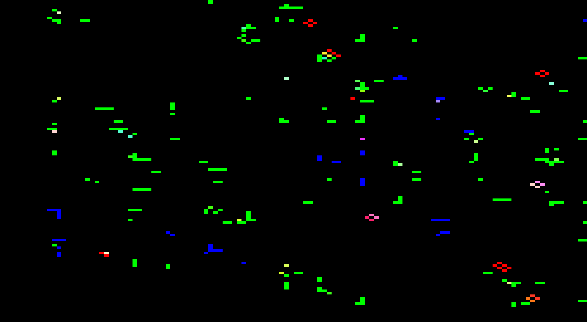
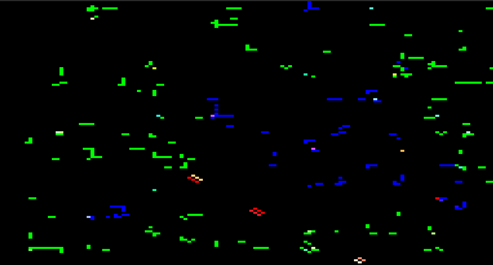
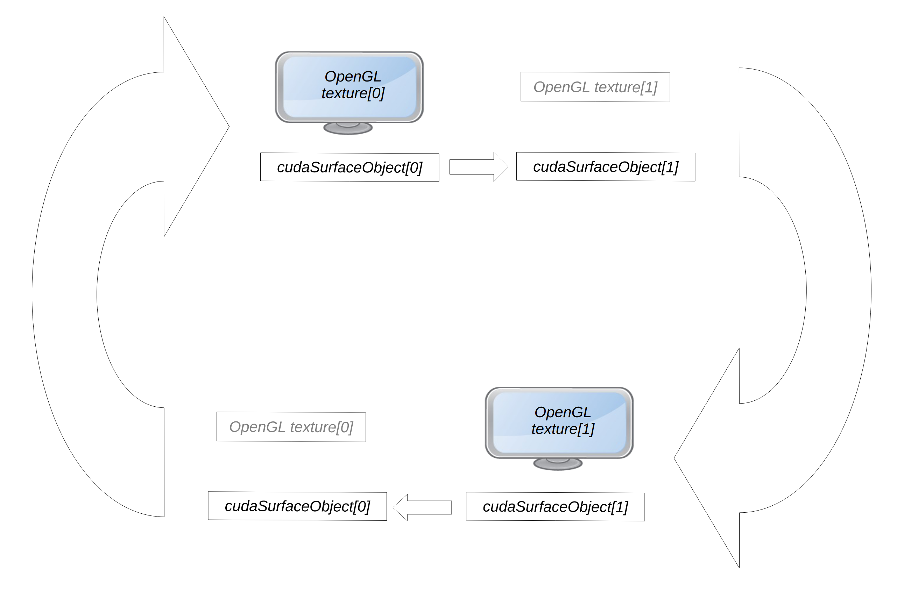

# GameOfLifeCUDA


Implementation of Conway’s Game of Life in Cuda with Visualization in OpenGL

# Description
This is my submission for the final project of the Course “GPU Programming” from the Institute of Informatics at the University of Osnabrück. 

To showcase the advantages of the GPU, it made sense to chose a project that compliments the usage of its logical cores. *Conway’s Game Of Life* fits perfectly, by consisting of a lot of easy operations that can run in parallel. 

I used Cuda kernels for the parallelization of the cells and chose OpenGL for the visualization. The coupling of the two was realized through the Cuda and OpenGL [interoperability](https://docs.nvidia.com/cuda/cuda-runtime-api/group__CUDART__OPENGL.html).

# Getting Started

## Dependencies
Cuda release: 11.5

OpenGL version: 4.6.0  

GLFW 3.3.6

System: Unix (Developed on Ubuntu 20.04)

## How to Install and Run the Project

- Clone the **Repository** or Download the ZIP File and extract.
- Navigate with the terminal to the project directory
- Run the following in the terminal:

- `$ qmake`

- Check with `$ ls` . There should be a MakeFile now.

- `$ make`

- Check with `$ ls` . You should see “GameOfLife” colored in green as the executable.

- `$ ./GameOfLife`

- The extra rules can be turned of and on by changing the bool variable “extra” in [main.cu](http://main.cu) .


# Game Of Life revisited

The basis of the Game Of Life are its cells.

The cell is represented as a Cuda *float4* value. This corresponds directly to how the cell will be drawn on screen, since the float4 can be translated into a rgba value thanks to the interoperability. 

A cell can either be dead or alive, the initialization of which happens with a fifty percent chance at the start. The *w* coordinate of the float4 value translates to *alpha* or the opacity, and is representative of the state: alive or dead. 

To add my own touch, I added three different species of cells: red, blue, and green, which are represented through their respective color components. I was interested in what would happen if I added rules that allowed the species to interact with each other. The motivation for which was, to see if I could get a state automaton that displays certain recognizable patterns like the *blinkers* or *pulsars* in the original Game of Life.

In every Generation all cells and their neighbors are evaluated. According to Conway’s Rules the future state of a cell will be calculated for the next Generation. The neighborhood is chosen to be the “*Moore neighborhood*”, meaning the eight surrounding cells are neighbors. 

For the basic implementation, the neighbors are visited in a nested *for loop* and their alpha component is added to `n_neighbors`.

For the colored cells, it made sense to first ask a given cell what color it is: if a color component of the cell is greater than the other components, the cell is defined as "being" that color. Instead of continuing to ask the neighbors what color they are, I simply add the respective color component of the neighbor to `n_neighbors`.

The calculation of the new state can be seen in the following Code Snippet. Because of the addition of the respective colors in the earlier step, the rule was changed to include ranges for `n_neighbors`. 

```cpp
bool new_state =
      (n_neighbors <= 3.4f && n_neighbors >= 2.5f) ||
      (n_neighbors <= 2.4f && n_neighbors >= 1.5f && state)
       ? 1 : 0;
```

## Results

Given the rules that a
- blue kills red
- green kills blue and red





A pattern that is recognizable from the original Game of Life is the “tub” as well as the “barge”, mostly appearing in the red species. 

Green dominates the screen, which makes sense, given it can kill the other two species with no drawbacks. For future experiments it would be interesting to change that. 

The patterns portrayed by blue and green cells are mostly horizontal and vertical stripe variations. 

More interestingly, the green and blue cells seem to “move” across the screen from left to right. This was both surprising and fascinating to me, as none of the rules hint to an expansion towards a given direction. 

Overall I am happy with how the automaton turned out and think it leads to a recognizable pattern or “movement”. 

# Implementation

Since I had no experience with Cuda or OpenGL, I decided to familiarize myself by implementing the Game of Life with Cuda only and printing the output to the terminal, as well as making mini Projects with OpenGl drawing simple triangles. Once I felt comfortable, the next big task was to make Cuda and OpenGl work together, which turned out to be a lot harder than expected. 

## Why use a Cuda Array?

Using a Cuda Array in your project -instead of a simple Array that you allocate on the GPU- has several advantages:

- You can recycle hardware the GPU uses for graphics for your surface memory:
    - “CUDA supports a subset of the texturing hardware that the GPU uses for graphics to access texture and surface memory.” [source](https://docs.nvidia.com/cuda/cuda-c-programming-guide/index.html#texture-and-surface-memory)
- The memory is cached and you can minimize the cost of reads:
    - “The texture and surface memory spaces reside in device memory and are cached in texture cache, so a texture fetch or surface read costs one memory read from device memory only on a cache miss, otherwise it just costs one read from texture cache.” [source](https://docs.nvidia.com/cuda/cuda-c-programming-guide/index.html#device-memory-accesses)
- “The texture cache is optimized for 2D spatial locality,
    - so threads of the same warp that read texture or surface addresses that are close together in 2D will achieve best  performance.” [source](https://docs.nvidia.com/cuda/cuda-c-programming-guide/index.html#device-memory-accesses)

In one sentence: “CUDA arrays are opaque memory layouts optimized for texture fetching.” [source](https://docs.nvidia.com/cuda/cuda-c-programming-guide/index.html#cuda-arrays) This also begs the question: 

## How to Access the Cuda Array and bind it to the OpenGL Texture?

We can access our Cuda Arrays by binding them to a *Cuda Surface Object* each, and utilizing surface reading and writing in the kernels. The binding of the Cuda Array with the Surface, as well as with the OpenGL Texture is rather complicated and is therefore visualized in fig. 1.

Thankfully, the binding of the Cuda Arrays needs to be done only once before the Main Loop.


fig. 1 Flowchart explaining **`setUpInterop()`** 

## How to switch between the Arrays in the Main Loop?

To calculate a new generation of cells, there needs to be a Cuda Array of the old generation, which we read from, and a Cuda Array for the new cells, which we write to. 

In Order to easily switch where to read from and where to write to both Surfaces are stored in an Array. Each Surface is then accessed with `i%2` and `(i+1)%2` (see Code Snippet below and fig. 2). 

The same goes for the OpenGL texture. Here, one texture is always unused whereas the other one is drawn to the screen. This is done to 1) not further complicate the binding process described above and 2) to prevent problems that come with drawing something that you are still writing to. 

```cpp
int i = 0;
while(!glfwWindowShouldClose(getWindow()))
{
		CHECK_CUDA(cudaDeviceSynchronize());
    rendering(texID[i%2]);
    launch_nextGen(surfObj[i%2], surfObj[(i+1)%2], width, height);
    i++;
}
```



fig. 2 Flowchart showcasing which layer to draw/read from in the Main loop

For this to be possible, I had to change what happens in the Main Loop. This is not possible with GLUT, which is why I am using GLWF. [source](https://gamedev.stackexchange.com/questions/8623/a-good-way-to-build-a-game-loop-in-opengl)


# Notes

## ToDos

Things that could be added in the future:

- make the executable more user friendly (redoing the Game with a simple input)
- more actions for the species (moving → fleeing and hunting)
- UI that allows to change how the species interact with each other (Drop Down menu of species and action)
- genetic algorithm mutation of the species

## Sources and Acknowledgments

To understand OpenGL: [https://learnopengl.com/Getting-started/Hello-Window](https://learnopengl.com/Getting-started/Hello-Window#) 

To understand the Cuda and OpenGL interopability: [https://github.com/Hello100blog/gl_cuda_interop_pingpong_st](https://github.com/Hello100blog/gl_cuda_interop_pingpong_st)

To understand Cuda:
- Youtube Tutorial: [https://www.youtube.com/watch?v=_41LCMFpsFs](https://www.youtube.com/watch?v=_41LCMFpsFs)
- Cuda Documentation: [https://docs.nvidia.com/cuda/](https://docs.nvidia.com/cuda/)

## Personal Comment

Unfortunately, I used a lot of the time I planned for this project for the coupling of Cuda and OpenGL. A lot of the functions from the Interop Library are now deprecated (for example cudaBindSurfaceToArray()) and need to be done otherwise.
Nethertheless, I learned a lot about GPU-Programming which I will be able to use in my projects going forward. I am thankful that I was allowed to participate in the course as a student from a different Institute.

## Obligatory Meme

](images/meme.gif)

[https://knowyourmeme.com/photos/917498-boardroom-suggestion](https://knowyourmeme.com/photos/917498-boardroom-suggestion)
